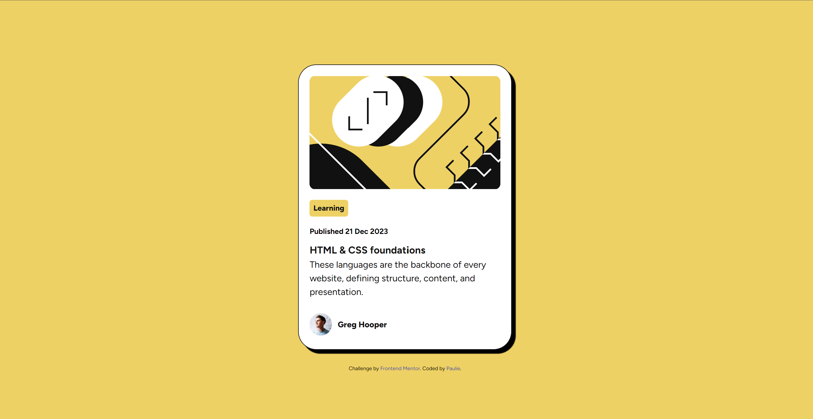

# Frontend Mentor - Blog preview card solution

This is a solution to the [Blog preview card challenge on Frontend Mentor](https://www.frontendmentor.io/challenges/blog-preview-card-ckPaj01IcS). Frontend Mentor challenges help you improve your coding skills by building realistic projects.

## Table of contents

- [Overview](#overview)
  - [The challenge](#the-challenge)
  - [Screenshot](#screenshot)
  - [Links](#links)
- [My process](#my-process)
  - [Built with](#built-with)
  - [What I learned](#what-i-learned)
  - [Continued development](#continued-development)
  - [Useful resources](#useful-resources)

## Overview

### The challenge

Users should be able to:

- See hover and focus states for all interactive elements on the page

### Screenshot

### Links

<!-- TODO: Add the links once they're live  -->

- Solution URL: [Add solution URL here](https://your-solution-url.com)
- Live Site URL: [Hosted on Github Pages](https://paul-mcaviney.github.io/blog-preview-card/)

## My process

### Built with

- HTML
- CSS custom properties
- Wee Bit O' Flexbox
- Someone else's CSS reset :p

### What I learned

Read about and tried to implement a CSS reset. I found a somewhat simple one that's not a complete reset, but I think works pretty good for my use-case.

Tried out CSS custom properties for the first time and thought it was pretty neat! Will be using those again moving forward.

Had to look up how to use media queries again though just to get the slightly different font-size with a small screen.

### Continued development

I think I need to spend more time with responsive design best practices. Mainly I'd like to confidently say a site I build will be completely responsive on different screen sizes while conforming to best practices.

### Useful resources

- [Hubspot Blog Post on CSS Reset](https://blog.hubspot.com/website/css-reset) - This article helped explain what a CSS reset file is. It also helped me understand the difference between a normalize file and a reset file. In short, a normalize file matches the base css with browser defaults while a reset file removes these defaults completely.
- [Josh Comeau's Custom CSS Reset](https://www.joshwcomeau.com/css/custom-css-reset/) - For the actual CSS reset file I used this one. It's a fairly short CSS file and may not even really fit the classical definition of CSS reset but Josh dives pretty deep into what everything does and why, so it was definitely a valuable resource. There's even some quiz-like structure to help you learn why he chose his specific implementation.
- [The MDN Docs on CSS Custom Properties](https://developer.mozilla.org/en-US/docs/Web/CSS/Using_CSS_custom_properties) - Trying to figure out how to use custom properties with CSS.
